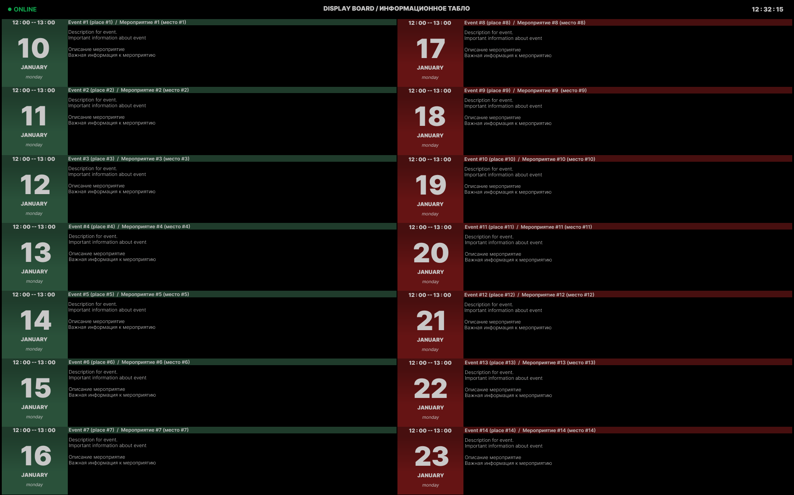
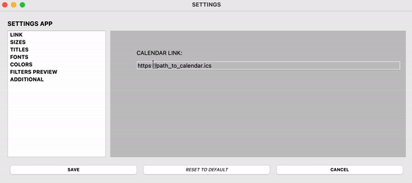

# ICS Display Board

[README - Русский](README_ru.md)


## Brief Description:

A PyQt GUI widget for displaying online calendar data.

## Idea:

My simple pet project started with an ecological agenda, and I'm not joking.

Once, I worked in a theater and encountered an unexpected archaism. The schedule of rehearsals, performances, and other events was still drawn up on a large sheet of paper by hand. This meant that the person responsible for various functions, including informing actors about rehearsals and performances, lost at least an hour of working time on scheduling for the week. Now imagine that this schedule could change several times a day.

Now about ecology - imagine how much paper is consumed annually to maintain this method of informing!

Therefore, the first reasonable proposal was to create a shared Google Calendar. This solved many problems. Your schedule is always on your phone or any other device. You can always check the current data or even set up notifications in case of any changes.

The problem of habit (or tradition) remained, where actors and other theater workers study the schedule for the week in a specially designated corner. The fact is that in the theater you can often be in a stage costume during performances or rehearsals, while your phone is in the dressing room.

Therefore, to preserve theatrical traditions but also fit into the ecological agenda, this project was created.

## How it works:

It works like an airport information board - events for the next 7 days are displayed on the screen in real-time.

The project is lightweight and undemanding, so it easily deployed on a Raspberry Pi, allowing it to run 24/7.

The application works with a link to a public calendar in .ics format.



Every 30-40 seconds, it requests up-to-date calendar data, filters them into two categories (in the theater, these were two different types of events: rehearsals and performances), and displays them on the screen as a table.

The application also has a settings window where you can configure everything from font selection to sorting keywords, making it versatile for other directions.



## Installation Instructions:

1. Clone the repository
2. Set up a virtual environment, for example:

    ```bash
    python -m venv .venv
    ```

3. Install the necessary libraries, for example:

    ```bash
    pip install PyQt5, screeninfo, icalendar
    ```

4. Run `run.py`
5. By right-clicking on the main screen - a menu will appear where you can select: "EXIT", "SETTINGS"
6. In the settings window, you can configure:
    - LINK - link to the online calendar in `.ics` format
    - WIDTH, HEIGHT - width and height of the main window
    - TOP, BOTTOM, LEFT, RIGHT INDENT - margins
    - MAIN, LEFT, RIGHT TITLE - titles
    - FONTS - fonts and sizes
    - COLORS - background, text, and table colors
    - FILTER PREVIEW - a list of strings to filter calendar data. Each side of the table can have its own strings (e.g., for the left - “rehearsals”, for the right - “performances”). The program searches for these strings in the event titles and then fills the appropriate side of the table.
    - ADDITIONAL - a template for additional settings that everyone can use for their purposes
7. You can set up autostart on Raspberry Pi through `systemd` or `rc.local`

## Dependencies:
* certifi==2024.6.2
* charset-normalizer==3.3.2
* Cython==3.0.10
* icalendar==5.0.12
* idna==3.7
* pyobjc-core==10.3.1
* pyobjc-framework-Cocoa==10.3.1
* PyQt5==5.15.10
* PyQt5-Qt5==5.15.14
* PyQt5-sip==12.13.0
* python-dateutil==2.9.0.post0
* pytz==2024.1
* requests==2.32.3
* screeninfo==0.8.1
* six==1.16.0
* urllib3==2.2.1
