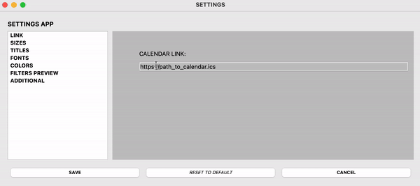

# ICS Display Board

[README - English](README_en.md)


## Краткое описание:

GUI виджет на PyQt для отображения данных онлайн календаря.

## Идея:

Мой простой пет-проект начался с экологической повестки, и я не шучу.

Однажды я работал в театре и столкнулся с неожиданным архаизмом. Расписание репетиций, спектаклей и прочих мероприятий до сих пор оформлялось на большом листке бумаги и от руки. То есть человек, у которого было ряд функций, включая информирование актеров о репетициях и спектаклях, терял как минимум час рабочего времени на оформление расписания на неделю. А теперь представьте, что в день это расписание могло меняться несколько раз.

Вернемся к экологии - представьте, сколько бумаги уходит в год на поддержание такого способа информирования!

Поэтому первым разумным предложением было завести общий google-календарь. Это решило многие проблемы. Твое расписание всегда в твоем телефоне или любом другом девайсе. Ты всегда можешь посмотреть актуальные данные или даже настроить оповещения на случай каких-то изменений.

Осталось решить проблему привычки (или же традиций), когда актеры и другие работники театра в специально отведенном уголке изучают график на неделю. Дело в том, что в театре ты часто можешь быть в сценическом костюме во время спектакля или репетиций, а телефон в гримерной комнате.

Поэтому чтобы сохранить театральные традиции, но при этом вписаться в экологическую повестку - был создан этот проект.

## Как работает:

Работает по принципу информационного табло в аэропорту - в режиме реального времени на экране отображаются мероприятия на ближайшие 7 дней.

Проект легковесный и не прихотливый, поэтому легко развернулся на Raspberry Pi, что позволило оставлять его работать 24/7.

Приложение работает со ссылкой на публичный календарь в формате .ics.


Каждые 30-40 секунд он запрашивает актуальные данные календаря, фильтрует их по двум категориям (в театре это было два разных типа мероприятий: репетиции и спектакли) и отображает на дисплее в виде таблицы.

Также в приложении реализовано окно настроек, в котором можно выполнить настройки от выбора шрифтов до ключевых слов для сортировки, что помогает использовать этот проект для других направлений.



## Инструкции по установке:

1. Клонируйте репозиторий
2. Установите виртуальное окружение, например:

    ```bash
    python -m venv .venv
    ```

3. Установите необходимые библиотеки, например:

    ```bash
    pip install PyQt5, screeninfo, icalendar
    ```

4. Запустите `run.py`
5. Нажав правой кнопкой по основному экрану - запустится меню, в котором можно выбрать: «ВЫЙТИ», «НАСТРОЙКИ»
6. В окне настроек можно настроить:
    - LINK - ссылка на онлайн календарь в формате `.ics`
    - WIDTH, HEIGHT - ширина и высота главного окна
    - TOP, BOTTOM, LEFT, RIGHT INDENT - отступы от края
    - MAIN, LEFT, RIGHT TITLE - заголовки
    - FONTS - шрифты и размеры
    - COLORS - цвета фона, текста и таблицы
    - FILTER PREVIEW - список строк, по которым фильтровать данные календаря. Для каждой стороны таблицы могут быть свои строки (к примеру для левой - “репетиции”, для правой - “спектакли”). Эти строки программа ищет в заголовках мероприятий и после чего заполняет нужную сторону таблицы.
    - ADDITIONAL - шаблон для дополнительных настроек, которые каждый может использовать под свои цели
7. Можно настроить автозапуск на Raspberry Pi через `systemd` или `rc.local`

## Зависимости:
* certifi==2024.6.2
* charset-normalizer==3.3.2
* Cython==3.0.10
* icalendar==5.0.12
* idna==3.7
* pyobjc-core==10.3.1
* pyobjc-framework-Cocoa==10.3.1
* PyQt5==5.15.10
* PyQt5-Qt5==5.15.14
* PyQt5-sip==12.13.0
* python-dateutil==2.9.0.post0
* pytz==2024.1
* requests==2.32.3
* screeninfo==0.8.1
* six==1.16.0
* urllib3==2.2.1
